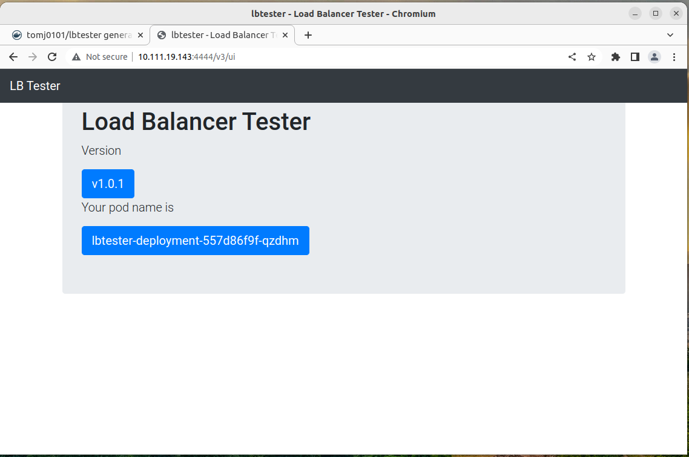

# lbtester
Docker images for Test load balancer


#### Push to your Private or Public containers register (DevOps)
Docker Hub (docker.io)
```
cd lbtester-js
docker build -t tomj0101/lbtester:lasted -f Dockerfile.lbtester .

docker run -p 8888:8888 tomj0101/lbtester:lasted

Create repo on dockerhub > https://hub.docker.com/repository

docker images

docker logout
docker login
docker push tomj0101/lbtester:lasted
```


#### Local Deploy in Kubernetes (MiniKube)
```
$ minikube start
$ minikube dashboard

open communication between your localhost and minikube cluster
# minikube tunnel

kubectl apply -f lbtester-deployment.yaml
kubectl delete -f lbtester-deployment.yaml

kubectl apply -f lbtester-service.yaml
kubectl delete -f lbtester-service.yaml

kubectl describe service lbtester-service -n sample-namespace
Name:                     lbtester-service
Namespace:                sample-namespace
Labels:                   app=lbtester
Annotations:              <none>
Selector:                 app=lbtester
Type:                     NodePort
IP Family Policy:         SingleStack
IP Families:              IPv4
IP:                       10.109.94.186
IPs:                      10.109.94.186
Port:                     <unset>  4444/TCP
TargetPort:               8888/TCP
NodePort:                 <unset>  31765/TCP
Endpoints:                172.17.0.10:8888,172.17.0.11:8888,172.17.0.12:8888 + 5 more...
Session Affinity:         None
External Traffic Policy:  Cluster
Events:                   <none>


Take the NodePort
open http://10.109.94.186:4444/v3/ui
open http://10.109.94.186:4444/v3/app


remove image from CACHE in minikube
minikube cache delete tomj0101/lbtester

load images from local to minikube
minikube image load tomj0101/lbtester:lasted


```


### Test the different output for the load balacer.
```
curl http://10.109.94.186:4444/v3/app
{"hostname":"lbtester-deployment-66798999d9-dmkk8"}

curl http://10.109.94.186:4444/v3/app
{"hostname":"lbtester-deployment-66798999d9-cj7hk"}

curl http://10.109.94.186:4444/v3/app
{"hostname":"lbtester-deployment-66798999d9-l4bm8"}

curl http://10.109.94.186:4444/v3/app
{"hostname":"lbtester-deployment-66798999d9-dmkk8"}

curl http://10.109.94.186:4444/v3/app
{"hostname":"lbtester-deployment-66798999d9-dmkk8"}

curl http://10.109.94.186:4444/v3/app
{"hostname":"lbtester-deployment-66798999d9-fxvv8"}

curl http://10.109.94.186:4444/v3/app
{"hostname":"lbtester-deployment-66798999d9-cmzx2"}

curl http://10.109.94.186:4444/v3/app
{"hostname":"lbtester-deployment-66798999d9-cj7hk"}
```


### Health endpoint
```
$ curl http://10.109.94.186:4444/v3/health

OR 

sudo apt install jq

$ curl http://10.109.94.186:4444/v3/health | jq
{
  "cpu": [
    {
      "model": "CPU Core 1 model",
      "speed": 2600,
      "times": {
        "user": 123NNN,
        "nice": 123NNN,
        "sys": 123NNN,
        "idle": 123NNN,
        "irq": 0
      }
    },
    {
      "model": "CPU Core 2 model",
      "speed": 123NNN,
      "times": {
        "user": 123NNN,
        "nice": 123NNN,
        "sys": 123NNN,
        "idle": 123NNN,
        "irq": 0
      }
    }
  ],
  "total_memory": "8 GB",
  "free_memory": "5 GB",
  "hostname": "lbtester-deployment-557d86f9f-t7sdb",
  "status": "UP"
}

```